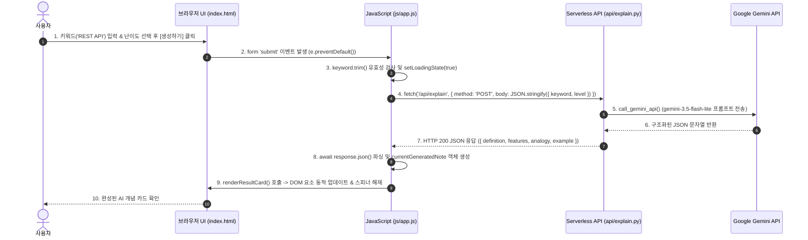

# 📋 ConceptNote AI 프로젝트 기반 학습 목표 자가 진단 및 구술 설명 가이드

본 문서는 **ConceptNote AI (AI 스마트 개념 학습 메모장)** 프로젝트의 실제 코드베이스([`index.html`](../index.html), [`css/style.css`](../css/style.css), [`js/app.js`](../js/app.js), [`api/explain.py`](../api/explain.py), [`vercel.json`](../vercel.json), [`docs/troubleshooting_guide.md`](troubleshooting_guide.md))를 바탕으로, 과제 완료 후 학습자가 스스로 설명할 수 있어야 하는 핵심 질문 6가지에 대한 모범 답변을 정리한 가이드입니다.

---

## 1. HTML / CSS / JavaScript의 각각의 역할

> **💡 한 줄 비유:** **HTML은 건물의 뼈대**, **CSS는 인테리어/도색**, **JavaScript는 전기/수도 및 엘리베이터 시스템**입니다.

* **HTML ([`index.html`](../index.html) - 구조와 뼈대):**
  * 사용자가 보게 되는 웹 페이지의 구조와 시맨틱 콘텐츠를 정의합니다.
  * **프로젝트 적용:** 
    * 네비게이션 헤더 (`#navbar`), 소개 섹션 (`#hero`), AI 개념 생성 폼 (`#concept-form`), 동적 결과 카드 (`#result-container`), 로컬 저장 메모장 (`#saved-notes-grid`), 자주 묻는 질문 (`#faq`) 등 4대 핵심 섹션을 구성했습니다.
* **CSS ([`css/style.css`](../css/style.css) - 디자인과 레이아웃):**
  * HTML 요소의 시각적 디자인, 반응형 그리드, 모던 글래스모피즘(Glassmorphism) 스타일을 적용합니다.
  * **프로젝트 적용:** 
    * CSS 변수(`--primary-600`, `--bg-card`, `--radius-lg` 등)를 정의해 일관된 디자인 시스템을 구축하고, 모바일/태블릿/데스크톱에 대응하는 Flex/Grid 미디어 쿼리를 구현했습니다.
* **JavaScript ([`js/app.js`](../js/app.js) - 인터랙션과 비동기 로직):**
  * 사용자의 입력 및 버튼 클릭 이벤트를 감지하고, 백엔드 API와의 비동기 통신 및 화면을 동적으로 조작(DOM 갱신)합니다.
  * **프로젝트 적용:** 
    * 키워드 입력 유효성 검사, `fetch('/api/explain')` 비동기 요청, 로딩 스피너 제어, `localStorage` 기반 노트 저장/삭제/조회, 토스트(Toast) 알림 출력을 제어합니다.

---

## 2. 사용자 입력 → Fetch 요청 → 화면 반영 흐름 (Request-Response Flow)



1. **이벤트 리스너 등록:** `conceptForm.addEventListener('submit', ...)`가 실행되어 기본 폼 새로고침을 방지(`e.preventDefault()`)합니다.
2. **입력값 추출 및 검증:** `keywordInput.value`를 확인하여 빈 값인 경우 사용자에게 토스트 경고(`showToast`)를 띄우고 중단합니다.
3. **비동기 요청 (`fetch`):** `fetch('/api/explain', { method: 'POST', headers: { 'Content-Type': 'application/json' }, body: JSON.stringify(...) })`를 통해 백엔드로 요청을 보냅니다.
4. **로딩 상태 전환:** 비동기 요청 동안 `setLoadingState(true)`를 호출하여 버튼 비활성화 및 스피너 애니메이션을 표시합니다.
5. **응답 수신 및 DOM 갱신:** 서버로부터 JSON 데이터를 전달받아 `renderResultCard()` 함수를 통해 `#result-definition`, `#result-features`, `#result-analogy`, `#result-example`의 텍스트와 HTML을 동적으로 갈아끼웁니다.

---

## 3. Vercel Serverless Functions와 프론트-백엔드(Python) 호출 구조

### (1) Serverless Functions의 개념
* 24시간 켜져 있는 고정 백엔드 서버 인스턴스(EC2 등) 없이, **클라이언트의 API 호출이 들어올 때만 순간적으로 격리된 가상 컨테이너가 기동되어 파이썬 코드를 실행하고 응답을 반환한 뒤 즉시 종료되는 이벤트 기반 FaaS(Function as a Service)** 모델입니다.
* 트래픽이 없을 때는 비용이 0원이며, 트래픽 급증 시 자동으로 인스턴스가 병렬 확장(Auto-scaling)됩니다.

### (2) 우리 프로젝트의 호출 및 라우팅 구조
* **디렉토리 라우팅:** 프로젝트의 `api/explain.py` 파일 내에 `BaseHTTPRequestHandler`를 상속받은 `handler` 클래스가 작성되어 있습니다.
* **[`vercel.json`](../vercel.json) 라우팅 맵핑:**
  ```json
  {
    "version": 2,
    "routes": [
      { "src": "/api/(.*)", "dest": "api/$1" },
      { "src": "/(.*)", "dest": "/$1" }
    ]
  }
  ```
  * 프론트엔드가 동일 오리진의 `/api/explain`으로 `fetch`를 호출하면, Vercel이 이를 가로채어 `api/explain.py`의 `do_POST` 메서드를 실행하고 Python 런타임 환경에서 Gemini API를 호출하여 결과를 클라이언트에 반환합니다.

---

## 4. 환경 변수로 API 키를 안전하게 관리해야 하는 이유

1. **클라이언트(브라우저) 소스코드 노출 방지:**
   * 만약 `js/app.js`에 `const API_KEY = "AIzaSy..."` 형태로 작성하면, 사용자가 **F12(개발자 도구)의 Sources 탭이나 Network 탭**에서 API 키를 그대로 탈취할 수 있습니다.
2. **GitHub 공개 저장소 유출 차단:**
   * API 키를 소스코드에 하드코딩하고 Git에 푸시하면, 깃허브 크롤링 봇에 의해 수초 내에 키가 스캔되어 과금 폭탄 및 계정 차단이 발생합니다.
3. **프로젝트의 실제 안전 조치:**
   * **로컬 환경:** `.env` 파일에 `GEMINI_API_KEY=...`를 정의하고, [`.gitignore`](../.gitignore)에 `.env`, `.env.local`을 명시하여 Git 커밋 대상에서 완벽히 배제했습니다.
   * **백엔드 접근:** 브라우저가 아닌 백엔드([`api/explain.py`](../api/explain.py))에서만 `os.environ.get("GEMINI_API_KEY")`로 환경 변수를 안전하게 읽어와 Google API 서버와 통신합니다.
   * **배포 환경:** Vercel 대시보드의 **Project Settings > Environment Variables**에 키를 등록하여 클라우드 서버리스 환경에만 주입되도록 구성했습니다.

---

## 5. 로컬 환경 vs 배포 환경의 차이 및 수정·재배포 흐름

### (1) 로컬 환경 vs 배포 환경 비교

| 비교 항목 | 로컬 환경 (Local Dev) | 배포 환경 (Production / Vercel) |
| :--- | :--- | :--- |
| **호스트 주소** | `http://localhost:8000` ([`server.py`](../server.py)) 또는 `localhost:3000` | `https://concept-note-ai-app.vercel.app` (글로벌 CDN) |
| **환경 변수 로드** | 로컬 `.env` 파일에서 `load_env()` 함수가 직접 파싱 | Vercel 플랫폼 시스템 환경변수에서 주입 |
| **백엔드 실행 주체** | 개발자 PC의 로컬 Python 3 인터프리터 ([`server.py`](../server.py)) | Vercel의 AWS Lambda 기반 격리 Linux 컨테이너 ([`api/explain.py`](../api/explain.py)) |
| **보안 및 SSL** | `http://` 개발용 비암호화 통신 | `https://` 자동 발급 SSL/TLS 암호화 통신 |

### (2) 실제 수정 및 재배포 흐름 (프로젝트 경험)
1. **문제 발견:** Vercel 배포 후 웹 페이지 접속 시 `404 Not Found` 발생 (빌드 설정 결함 확인).
2. **원인 분석 & 로컬 수정:** `vercel.json`에서 restrictive한 `builds` 구문을 범용적인 `routes` 구조로 수정.
3. **로컬 테스트 검증:** `python server.py`를 통해 로컬에서 프론트와 API가 정상 연동되는지 재확인.
4. **Git 버전 관리 커밋 & 푸시:**
   ```bash
   git add vercel.json
   git commit -m "fix: vercel.json 정적 파일 및 API 라우팅 설정 수정"
   git push origin main
   ```
5. **Vercel CI/CD 자동 재배포:** Git Push 이벤트를 수신한 Vercel 빌드 시스템이 30초 내에 새로운 프로덕션 배포 버전을 무중단 갱신.

---

## 6. AI 코딩 도구 사용 시 오류 원인 파악 및 수정 방향 설명 역량

AI 코딩 도구가 생성한 코드라도 개발자가 시스템 아키텍처와 디버깅 흐름을 이해하고 있어야만 실제 동작하는 서비스를 완성할 수 있습니다. 본 프로젝트에서 실제로 겪고 해결한 대표 트러블슈팅 사례([`docs/troubleshooting_guide.md`](troubleshooting_guide.md))로 이를 설명할 수 있습니다.

### 📌 실제 프로젝트 트러블슈팅 사례 3선

#### ① `vercel.json` 빌드 설정으로 인한 정적 파일 404 오류
* **오류 현상:** 배포 후 사이트 접속 시 `404: NOT_FOUND` 발생.
* **원인:** AI가 추천한 `builds: [{ "src": "api/explain.py", "use": "@vercel/python" }]` 설정이 Vercel에게 파이썬 파일 1개만 빌드하도록 지시하여 `index.html`, `css`, `js` 등 정적 파일 서빙이 통째로 누락됨.
* **수정 방향:** `builds`를 제거하고 `routes`를 통해 `/api/(.*)`는 백엔드로, `/(.*)`는 루트 정적 파일로 전달하도록 라우팅 테이블을 재구성하여 해결.

#### ② 로컬 개발 서버([`server.py`](../server.py))의 소켓 I/O 블로킹 무한 로딩 오류
* **오류 현상:** 로컬에서 버튼 클릭 시 응답이 오지 않고 스피너가 무한히 회전함.
* **원인:** `LocalDevHandler`에서 `ExplainHandler`를 재인스턴스화하면서 `BaseHTTPRequestHandler.__init__`이 소켓 헤더 파싱을 중복 시도해 스레드가 블로킹됨.
* **수정 방향:** 중복 핸들러 객체 생성을 제거하고, `api/explain.py`의 핵심 비즈니스 로직 함수(`load_env`, `call_gemini_api`, `parse_json_from_llm`)만 직접 호출하여 HTTP 200 JSON을 즉시 반환하도록 리팩토링.

#### ③ Vercel CLI 로컬 캐시 링킹 충돌 오류
* **오류 현상:** CLI 배포 명령 실행 시 `Detected linked project does not have "id"` 예외 발생.
* **원인:** Windows 로컬 캐시 디렉토리(`AppData/Local/com.vercel.cli`)에 이전 시도의 불완전한 임시 프로젝트 메타데이터가 잔류하여 링킹 절차가 중단됨.
* **수정 방향:** 로컬 캐시 디렉토리를 초기화하고, `vercel project add` 및 `vercel link`로 신규 프로젝트 ID를 정상 발급받아 재배포 파이프라인 복구.

---

### 💡 구술 면접 / 과제 발표 요약 멘트 (30초 템플릿)
> *"저희 서비스 **ConceptNote AI**는 바닐라 HTML/CSS/JS로 구성된 프론트엔드와 Vercel Python Serverless Function(`api/explain.py`)을 연동한 풀스택 AI 웹 앱입니다. 브라우저의 `fetch` 비동기 요청을 통해 백엔드로 키워드를 전달하고, 백엔드는 서버리스 환경변수로 안전하게 격리된 `GEMINI_API_KEY`를 사용해 Google Gemini 모델을 호출한 뒤 정형화된 JSON 카드로 응답합니다. 개발 과정에서 발생한 Vercel 404 라우팅 누락 및 로컬 서버 블로킹 이슈는 `vercel.json`의 라우팅 구조 개편과 파이썬 핸들러 리팩토링을 통해 체계적으로 해결하였으며, GitHub 연동 Vercel CI/CD를 통해 안정적으로 무중단 배포를 달성했습니다."*
