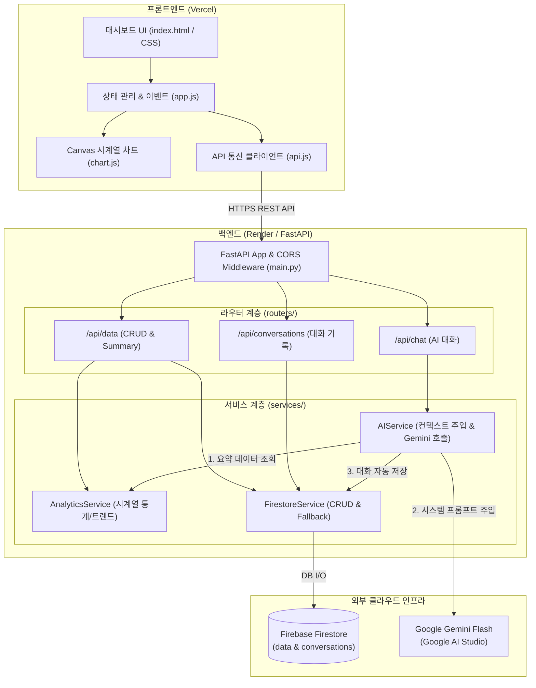

# 📈 M1-2: AI Agent 개발 - 나만의 AI 비서 구축 (Time-Series Assistant)

> **"내 상황과 데이터를 이해하고 맞춤형 인사이트를 제공하는 실시간 컨텍스트 주입형 AI 비서 서비스"**

본 프로젝트는 120개 이상의 시계열 데이터를 분석/요약하여 **Google Firebase Firestore**에 저장하고, 이를 시스템 프롬프트에 실시간으로 주입(Context Injection)하여 **Google Gemini 2.5/3.7 Flash** 모델을 통해 데이터 기반의 신뢰성 있는 질의응답을 제공하는 풀스택 웹 애플리케이션입니다.

---

## 🌐 실제 배포 서비스 URL

| 서비스 영역 | 배포 플랫폼 | 접속 URL | 설명 |
| :--- | :--- | :--- | :--- |
| **Frontend Web** | **Vercel** | [https://codyssey-m1-2.vercel.app](https://codyssey-m1-2.vercel.app) | 대시보드 웹 서비스 (차트/채팅/CRUD) |
| **Backend API** | **Render** | [https://codyssey-m1-2.onrender.com](https://codyssey-m1-2.onrender.com) | FastAPI REST API 서버 |
| **Swagger UI** | **Vercel / Render** | [https://codyssey-m1-2.vercel.app/docs](https://codyssey-m1-2.vercel.app/docs)<br>[https://codyssey-m1-2.onrender.com/docs](https://codyssey-m1-2.onrender.com/docs) | 대화형 OpenAPI 명세 및 테스트 (양쪽 모두 지원) |

---

## 🌟 핵심 기능

1. **📊 시계열 데이터 관리 (CRUD)**
   - `(date, value, memo, category)` 구조의 데이터 등록, 목록 조회, 수정, 삭제
   - 데이터 변경 시 화면의 통계 카드 및 시계열 차트 실시간 3중 동기화
2. **📈 실시간 데이터 요약 및 트렌드 분석 (`/api/data/summary`)**
   - 분석 기간, 총합, 평균, 최고/최저치 및 최근 7일 대비 추세(상승/하강/안정) 자동 산출
3. **🤖 컨텍스트 주입형 AI 맞춤 대화 (`/api/chat`)**
   - 최신 요약 데이터를 시스템 프롬프트에 동적 삽입하여 **Google Gemini Flash** 호출
   - AI 대화 내역은 Firestore `conversations` 컬렉션에 자동 저장(Auto-Persistence)
4. **💬 이전 대화 기록 관리 및 복원**
   - 대화 세션 목록 조회, 특정 대화 클릭 시 이전 메시지 히스토리 전체 복원, 대화 삭제
5. **🎨 프리미엄 바닐라 프론트엔드 UI & 시각화**
   - 순수 HTML5/CSS3/JavaScript 바닐라 구현
   - HTML5 Canvas 기반 인터랙티브 시계열 라인 차트 (호버 툴팁 지원)
   - 라이트/다크 모드 전환, 반응형 모바일 최적화, CSV/JSON 데이터 내보내기

---

## 🏗️ 시스템 아키텍처



---

## 🛠️ 기술 스택

| 영역 | 사용 기술 | 설명 |
| :--- | :--- | :--- |
| **Backend** | **Python 3.10+**, **FastAPI**, **Uvicorn** | 고성능 비동기 REST API 서버 및 자동 Swagger 문서화 |
| **Data Validation** | **Pydantic v2** | 요청 및 응답 데이터 타입 유효성 검증 |
| **Database** | **Google Firebase Firestore** | 실시간 NoSQL 클라우드 DB (`data`, `conversations` 컬렉션) |
| **AI Engine** | **Google Gemini Flash (3.7 / 2.5 / 2.0)** | 무료 API 키 활용 및 컨텍스트 주입형 챗봇 엔진 |
| **Frontend** | **Vanilla HTML5 / CSS3 / ES6+ JS** | 프레임워크 미사용, Canvas 2D 시각화, 디자인 토큰 테마 |
| **Deployment** | **Render** (백엔드) / **Vercel** (프론트엔드) | 클라우드 자동 배포 파이프라인 (CI/CD) |

---

## 📁 디렉토리 구조

```
M1-2/
├── M1-2_명세서.md              # 과제 요구사항 및 평가 기준 명세서
├── README.md                   # M1-2 프로젝트 종합 소개 문서
└── 과제산출물/
    ├── README.md               # 산출물 상세 문서
    ├── M1-2_평가_대비_답변서.md # 평가 가이드 질문 1~4번 전수 심층 기술 답변서
    ├── .env.example            # 환경변수 템플릿
    ├── .gitignore              # 보안 키 파일 및 불필요 파일 제외
    ├── requirements.txt         # 백엔드 필수 라이브러리 목록
    ├── vercel.json              # Vercel 프론트엔드 라우팅 설정
    ├── test_backend.py         # 백엔드 E2E 통합 테스트 스크립트
    │
    ├── main.py                  # FastAPI 앱 진입점, CORS, 정적 서빙
    ├── config.py                # 환경변수 로더 및 Gemini/Firestore 초기화
    ├── seed_data.py             # 120개 초기 시계열 데이터 Firestore 배치 시딩
    │
    ├── models/                  # Pydantic v2 스키마
    │   ├── data_model.py
    │   ├── conversation_model.py
    │   └── chat_model.py
    │
    ├── services/                # 비즈니스 로직 계층
    │   ├── firestore_service.py # Firestore CRUD 및 In-Memory Fallback
    │   ├── analytics_service.py # 시계열 통계 및 트렌드 분석 엔진
    │   └── ai_service.py        # Gemini 컨텍스트 주입 및 Tool Calling
    │
    ├── routers/                 # REST API 라우터
    │   ├── data_router.py       # /api/data (CRUD 4개 + /summary 1개)
    │   ├── conversation_router.py # /api/conversations
    │   └── chat_router.py       # /api/chat
    │
    ├── data/
    │   └── sample_timeseries.json # 120개 일일 시계열 샘플 데이터
    │
    ├── index.html               # 싱글페이지 대시보드 웹앱
    ├── css/
    │   └── style.css            # Glassmorphism 모던 UI, 다크모드, 반응형
    └── js/
        ├── api.js               # REST API 비동기 통신 클라이언트
        ├── chart.js             # Canvas 기반 인터랙티브 시계열 라인 차트
        └── app.js               # UI 컨트롤러 및 이벤트 오케스트레이션
```

---

## 🚀 로컬 실행 방법

```bash
# 1. 과제산출물 폴더로 이동
cd M1-2/과제산출물

# 2. 가상환경 생성 및 활성화
python -m venv venv
# Windows:
venv\Scripts\activate
# Mac/Linux:
source venv/bin/activate

# 3. 의존성 설치
pip install -r requirements.txt

# 4. 환경변수 설정 (.env 파일 생성)
cp .env.example .env
# .env에 GEMINI_API_KEY 입력 및 service_account.json 배치

# 5. 서버 실행
python main.py
```
* 🌐 웹 브라우저 접속: `http://localhost:8000`
* 📑 Swagger API 문서: `http://localhost:8000/docs`

---

## 📚 평가 질문별 기술 답변서
동료 및 전문가 평가 가이드(질문 1~4)에 대한 세부 답변 전문은 [과제산출물/M1-2_평가_대비_답변서.md](file:///c:/Users/pnlkc/AIProject/Codyssey/M1-2/%EA%B3%BC%EC%A0%9C%EC%82%B0%EC%B6%9C%EB%AC%BC/M1-2_%ED%8F%89%EA%B0%80_%EB%8C%80%EB%B9%84_%EB%8B%B5%EB%B3%80%EC%84%9C.md)를 참고해 주시기 바랍니다.
