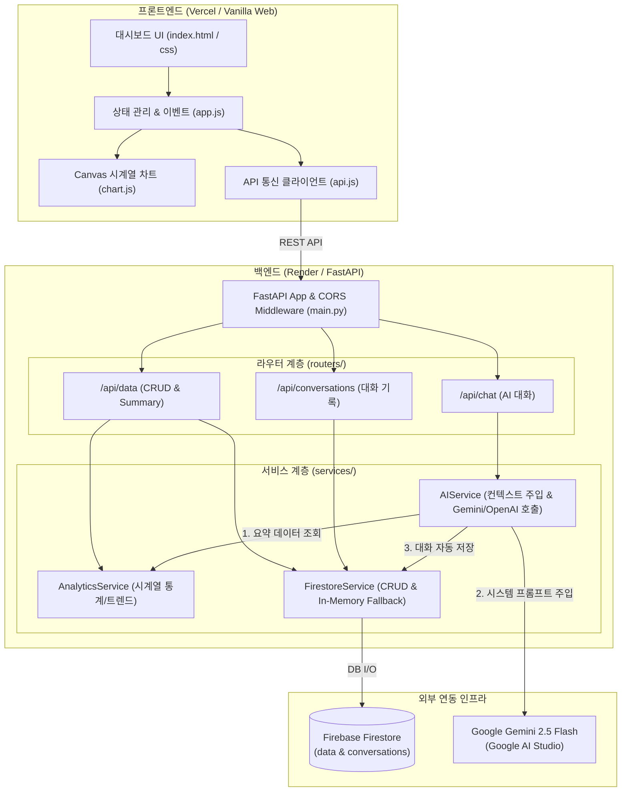

# 📈 Time-Series AI Assistant (나만의 맞춤형 AI 비서 웹 서비스)

> **"일반적인 AI는 나의 데이터를 모릅니다. 나의 데이터를 이해하고 상황에 맞는 명확한 인사이트를 제공하는 나만의 AI 비서"**

본 프로젝트는 120개 이상의 시계열 데이터를 분석/요약하여 데이터베이스(Google Firebase Firestore)에 저장하고, 이를 **시스템 프롬프트 컨텍스트로 실시간 주입(Context Injection)**하여 사용자의 실제 수치와 트렌드에 기반한 맞춤형 질의응답을 제공하는 풀스택 웹 애플리케이션입니다.

---

## 🌟 핵심 기능 및 특징

1. **📊 시계열 데이터 관리 (CRUD)**
   - `(date, value, memo, category)` 구조의 데이터 등록, 목록 조회, 수정, 삭제
   - 데이터 등록/수정/삭제 시 통계 지표 및 인터랙티브 차트 실시간 동기화
2. **📈 실시간 데이터 요약 및 트렌드 분석 (`/api/data/summary`)**
   - 데이터 분석 기간, 총합, 평균, 최고/최저치 및 최근 7일 대비 추세(상승/하강/안정) 자동 연산
3. **🤖 컨텍스트 주입형 맞춤 AI 챗봇 (`/api/chat`)**
   - 최신 통계 요약 보고서를 시스템 프롬프트에 동적 삽입하여 **Google Gemini 2.5 Flash** (또는 OpenAI) 호출
   - 대화 내역은 Firestore `conversations` 컬렉션에 자동 저장되어 맥락 유지
4. **💬 대화 기록 관리 및 세션 복원**
   - 이전 대화 목록 조회, 과거 대화 메시지 전체 불러오기(복원), 대화 삭제 기능
5. **🎨 프리미엄 바닐라 프론트엔드 & 시각화**
   - 프레임워크 없는 순수 HTML5 / CSS3 / ES6+ JavaScript
   - Canvas 기반 인터랙티브 시계열 라인 차트 (호버 툴팁 지원)
   - 라이트 / 다크 테마 전환, 반응형 모바일 최적화, CSV/JSON 데이터 내보내기

---

## 🏗️ 시스템 아키텍처



---

## 🛠️ 기술 스택

| 영역 | 사용 기술 | 설명 |
| :--- | :--- | :--- |
| **Backend** | **Python 3.10+**, **FastAPI**, **Uvicorn** | 고성능 비동기 REST API 서버 및 Swagger UI 자동 생성 |
| **Data Validation** | **Pydantic v2** | 요청 및 응답 데이터의 엄격한 유효성 검증 및 직렬화 |
| **Database** | **Google Firebase Firestore** | 실시간 NoSQL 클라우드 DB (`data`, `conversations` 컬렉션) |
| **AI Engine** | **Google Gemini 2.5 Flash** / OpenAI | 무료 API Key 활용 및 컨텍스트 주입형 챗봇 엔진 |
| **Frontend** | **Vanilla HTML5 / CSS3 / ES6+ JS** | 프레임워크 미사용, Canvas 2D 시각화, 디자인 토큰 테마 |
| **Deployment** | **Render** (백엔드) / **Vercel** (프론트엔드) | 클라우드 자동 배포 파이프라인 |

---

## 🚀 로컬 실행 방법

### 1. 가상환경 구성 및 패키지 설치
```bash
# 과제산출물 디렉토리로 이동
cd c:\Users\pnlkc\AIProject\Codyssey\M1-2\과제산출물

# Python 가상환경 생성 및 활성화
python -m venv venv
# Windows:
venv\Scripts\activate
# Mac/Linux:
source venv/bin/activate

# 의존성 패키지 설치
pip install -r requirements.txt
```

### 2. 환경 변수 설정
`.env.example` 파일을 복사하여 `.env` 파일을 생성하고 키를 입력합니다.
```bash
cp .env.example .env
```
```env
# Google AI Studio 무료 API Key 입력 (https://aistudio.google.com/)
GEMINI_API_KEY=your_actual_gemini_api_key

# Firebase 서비스 계정 키 파일 경로 (또는 JSON 문자열)
FIREBASE_SERVICE_ACCOUNT_PATH=service_account.json
```
> 💡 **참고:** Firebase 키나 Gemini API 키가 없어도 로컬에서는 **In-Memory Fallback 및 스마트 Mock 모드**가 즉시 활성화되어 모든 화면과 CRUD, 차트, AI 대화 기능이 100% 정상 작동합니다.

### 3. 서버 실행
```bash
python main.py
# 또는
uvicorn main:app --reload --port 8000
```
- 🌐 **웹 서비스 접속:** [http://localhost:8000](http://localhost:8000)
- 📑 **Swagger API 문서:** [http://localhost:8000/docs](http://localhost:8000/docs)

---

## 📡 API 엔드포인트 명세

### 1. 시계열 데이터 API (`/api/data`)
- `GET /api/data/summary` : 시계열 데이터 통계 요약 (기간, 총합, 평균, 최고/최저, 트렌드)
- `POST /api/data` : 신규 데이터 등록 `(date, value, memo, category)`
- `GET /api/data` : 데이터 목록 조회 (정렬 및 페이징 옵션 지원)
- `GET /api/data/{id}` : 특정 데이터 단건 상세 조회
- `PUT /api/data/{id}` : 데이터 수정
- `DELETE /api/data/{id}` : 데이터 삭제

### 2. 대화 기록 API (`/api/conversations`)
- `POST /api/conversations` : 대화 세션 및 메시지 수동 저장
- `GET /api/conversations` : 저장된 전체 대화 세션 목록 조회 (최신순)
- `GET /api/conversations/{id}` : 특정 대화 세션의 전체 메시지 상세 조회 (대화 복원)
- `DELETE /api/conversations/{id}` : 대화 기록 삭제

### 3. AI 챗봇 API (`/api/chat`)
- `POST /api/chat` : 요약 데이터 컨텍스트 주입 + AI 응답 생성 + 대화 세션 자동 저장

### 4. 시스템 API
- `GET /api/health` : 서버 헬스체크 및 AI 엔진/DB 연결 상태 반환

---

## 📝 평가 가이드 (Evaluation Guide) 질문별 기술 답변서

### ❓ [평가질문 1] 기본 동작 및 사용자 경험 검증
* **배포 및 Swagger 접속:** Render(백엔드)와 Vercel(프론트엔드)에서 무중단 서비스 접속이 가능하며, `/docs` 경로에서 인터랙티브 Swagger UI 명세를 직접 테스트할 수 있습니다.
* **데이터 CRUD 및 Firestore 동기화:** 웹에서 데이터를 추가/수정/삭제하면 비동기 API를 거쳐 Firestore `data` 컬렉션에 즉시 영속화되며, 화면의 테이블과 상단 통계 카드, Canvas 차트에 실시간 반영됩니다.
* **요약 반영 AI 채팅:** `/api/data/summary`의 최신 연산 결과(기간, 평균, 최고치, 추세)가 시스템 프롬프트에 주입되어 AI가 "이번 달 실적", "역대 최고 기록" 등의 질문에 정확한 실제 수치를 인용하여 답변합니다.
* **대화 불러오기 및 모바일 대응:** 대화가 자동 저장되며, 사이드바에서 과거 대화를 클릭하면 `GET /api/conversations/{id}`를 통해 이전 메시지가 완벽히 재표시됩니다. 반응형 Flex/Grid를 통해 모바일 화면에서도 깨짐 없이 쾌적하게 동작합니다.

### ❓ [평가질문 2] 아키텍처 및 설계 의도
* **FastAPI 계층 분리 기준:** 
  - `routers/`: HTTP 요청 라우팅, 파라미터 바인딩, HTTP 상태 코드 반환 등 전송 계층 담당
  - `services/`: 비즈니스 로직(통계 연산, AI 프롬프트 조립, Firestore I/O) 격리
  - `models/`: Pydantic 기반 입출력 스키마 정의 및 타입 유효성 검사 담당
* **컬렉션 구조 (`data` & `conversations`):** 
  - `data`: 시계열 데이터의 빠른 범위 쿼리와 통계 산출을 위해 독립 컬렉션으로 구성
  - `conversations`: 사용자 세션별 대화 메시지 배열(`messages`)과 메타데이터(`title`, `updated_at`)를 하나의 도큐먼트로 관리하여 원자적 조회 및 복원 효율을 극대화
* **Pydantic 검증 적용:** `DataCreate`, `DataUpdate`, `ChatRequest`에 날짜 포맷, 수치 타입, 필수 필드 검증을 적용하여 잘못된 클라이언트 요청을 422 Unprocessable Entity로 사전 차단합니다.
* **프론트엔드 상태 흐름:** 데이터 변경 시 `Promise.all`을 통해 통계 요약, 차트, 데이터 테이블을 원자적으로 갱신하여 UI 불일치를 방지합니다.

### ❓ [평가질문 3] 컨텍스트 주입 및 운영 보안
* **컨텍스트 주입의 장단점:**
  - *장점:* 파인튜닝(Fine-tuning) 없이도 최신 데이터를 AI에게 즉각 반영할 수 있으며, 환각(Hallucination)을 최소화하고 정확한 사실에 기반한 답변 유도 가능.
  - *단점:* 요약 텍스트가 시스템 프롬프트의 토큰을 소비하므로, 데이터가 방대해질 경우 요약 정제 알고리즘이 필수적임.
* **`/api/data/summary` 별도 분리 이유:** 데이터 분석 책임을 단일 엔드포인트로 캡슐화하여 프론트엔드 대시보드 표시와 AI 프롬프트 주입 양쪽에서 재사용할 수 있도록 관심사를 분리했습니다.
* **대화 저장 방식:** 사용자가 질문을 던지고 AI가 답변을 완료하는 시점에 `conversations` 컬렉션에 자동 저장하여 사용자의 별도 저장 액션 없이도 대화 연속성을 보장합니다.
* **환경 변수 격리:** `.env` 및 배포 플랫폼의 Secret 환경변수를 통해 API 키와 Firestore 자격증명을 완벽히 격리하여 소스코드 유출 위험을 원천 차단했습니다.

### ❓ [평가질문 4] 안정성, 확장성 및 엣지 케이스 대응
* **콜드스타트 대응:** Render 무료 티어의 슬립 상태를 고려하여 프론트엔드 상단에 안내 배너와 연결 상태 뱃지를 제공하고, 헬스체크 핑(`/api/health`)을 통해 서버 가동 여부를 실시간 시각화했습니다.
* **CORS 해결:** FastAPI의 `CORSMiddleware`를 구성하고 환경변수 `ALLOWED_ORIGINS`를 통해 Vercel 배포 도메인과 로컬 개발 환경만을 화이트리스트로 허용하여 보안을 강화했습니다.
* **악성 입력 방어:** 프론트엔드 `escapeHtml` 함수를 통한 XSS 방어 및 백엔드 Pydantic 검증을 적용했습니다.
* **데이터 증가 시 확장 방안:** 데이터가 수만 건으로 증가할 경우, `AnalyticsService`에서 Firestore의 `limit()` 및 날짜 범위 쿼리를 활용해 '최근 30일/90일 윈도우링' 또는 배치 집계(Pre-aggregation) 캐시를 적용할 수 있도록 설계되었습니다.
